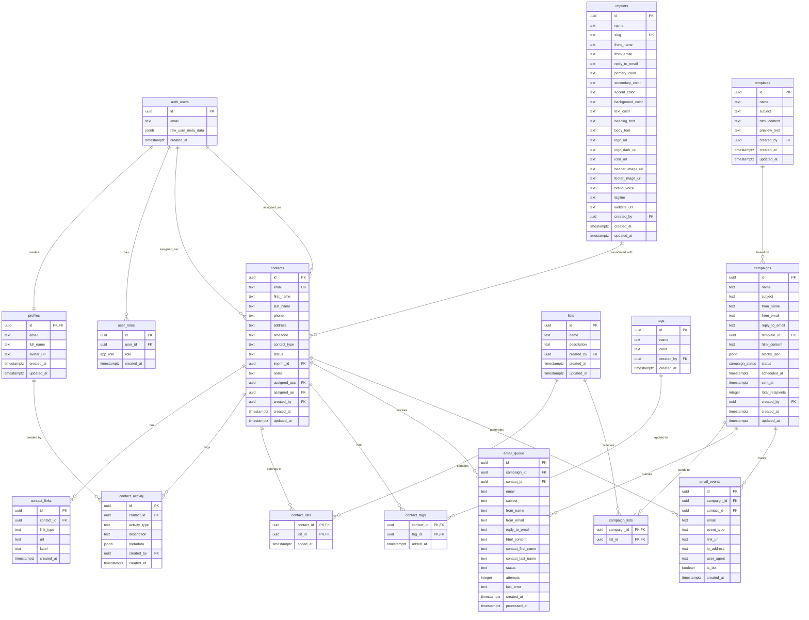
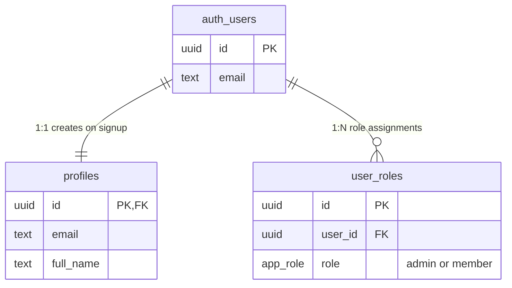
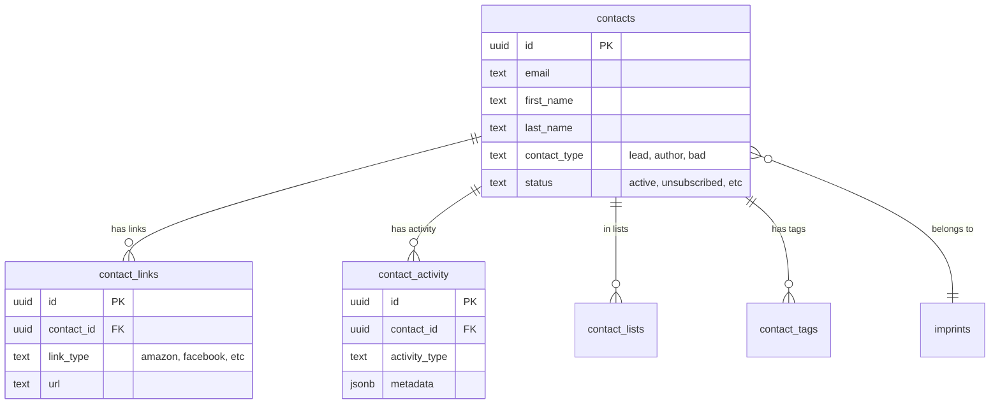
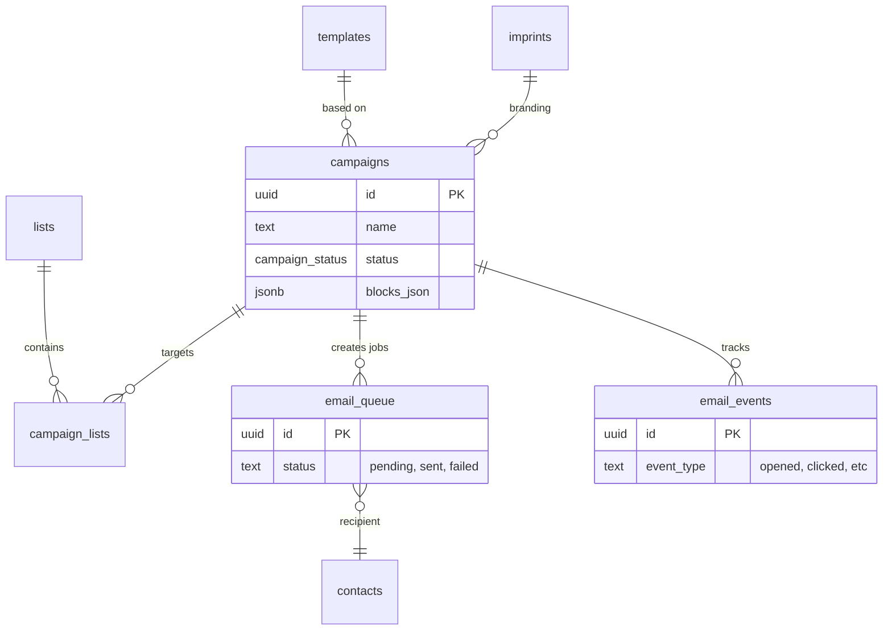
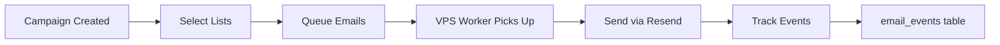
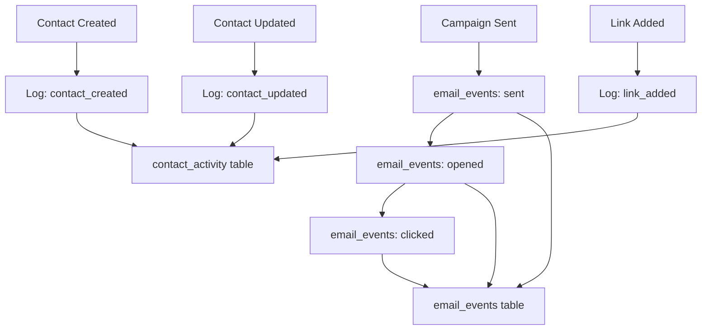

# Entity Relationship Diagram

> Visual database schema for Author Services Platform
>
> **Last Updated:** 2025-12-07

---

## Complete ERD

---

## Module Diagrams

### Authentication & Access Control

### CRM Contacts

### Email Campaign Flow

---

## Data Flow Diagrams

### Campaign Send Flow

### Contact Activity Flow

---

## Notes

- **PK** = Primary Key
- **FK** = Foreign Key
- **UK** = Unique Key
- All UUIDs use `gen_random_uuid()` for generation
- All timestamps are `TIMESTAMPTZ` (timezone-aware)
- RLS is enabled on all tables
- `auth.users` is managed by Supabase Auth (not directly modifiable)
