# Entity Relationship Diagram

> Visual database schema for Author Services Platform
>
> **Last Updated:** 2025-01-05

---

## Complete ERD

```mermaid
erDiagram
    %% ==========================================
    %% AUTHENTICATION & ACCESS CONTROL
    %% ==========================================
    
    auth_users {
        uuid id PK
        text email
        jsonb raw_user_meta_data
        timestamptz created_at
    }
    
    profiles {
        uuid id PK,FK
        text email
        text full_name
        text avatar_url
        text phone
        text title
        boolean active
        timestamptz created_at
        timestamptz updated_at
    }
    
    user_roles {
        uuid id PK
        uuid user_id FK
        app_role role
        timestamptz created_at
    }
    
    auth_users ||--|| profiles : "creates"
    auth_users ||--o{ user_roles : "has"
    
    %% ==========================================
    %% COMPANY & BRANDS
    %% ==========================================
    
    company {
        uuid id PK
        text name
        text slug
        text tagline
        text phone
        text legal_address
        text website_url
        text primary_color
        text secondary_color
        text accent_color
        text heading_font
        text body_font
        text logo_url
        text logo_dark_url
        text from_name
        text from_email
        text brand_voice
        timestamptz created_at
        timestamptz updated_at
    }
    
    imprints {
        uuid id PK
        uuid company_id FK
        text name
        text slug UK
        text from_name
        text from_email
        text reply_to_email
        text primary_color
        text secondary_color
        text accent_color
        text heading_font
        text body_font
        text logo_url
        text brand_voice
        uuid created_by FK
        timestamptz created_at
        timestamptz updated_at
    }
    
    company ||--o{ imprints : "has"
    
    %% ==========================================
    %% STAFF & USERS
    %% ==========================================
    
    staff {
        uuid id PK
        text full_name
        text email
        text phone
        text title
        text department
        boolean active
        uuid user_id FK
        timestamptz created_at
        timestamptz updated_at
    }
    
    user_email_connections {
        uuid id PK
        uuid user_id FK
        text provider
        text email
        text access_token
        text refresh_token
        timestamptz token_expires_at
        timestamptz last_inbox_sync_at
        timestamptz created_at
    }
    
    profiles ||--o| staff : "linked to"
    profiles ||--o{ user_email_connections : "has"
    
    %% ==========================================
    %% CRM - CONTACTS
    %% ==========================================
    
    contacts {
        uuid id PK
        text email UK
        text first_name
        text last_name
        text search_name
        text phone
        text phone_normalized
        text address
        text timezone
        text contact_type
        text status
        lead_source lead_source
        text lead_source_detail
        uuid imprint_id FK
        text notes
        uuid assigned_asc FK
        uuid assigned_ae FK
        uuid staff_asc_id FK
        uuid staff_ae_id FK
        uuid created_by FK
        timestamptz created_at
        timestamptz updated_at
    }
    
    contact_links {
        uuid id PK
        uuid contact_id FK
        text link_type
        text url
        text label
        timestamptz created_at
    }
    
    contact_activity {
        uuid id PK
        uuid contact_id FK
        text activity_type
        text description
        jsonb metadata
        uuid created_by FK
        timestamptz created_at
    }
    
    contact_communications {
        uuid id PK
        uuid contact_id FK
        uuid deal_id FK
        text type
        text direction
        text subject
        text body
        text notes
        text status
        text outcome
        integer duration_seconds
        text external_id
        uuid created_by FK
        timestamptz created_at
    }
    
    contact_notes {
        uuid id PK
        uuid contact_id FK
        uuid deal_id FK
        text content
        uuid created_by FK
        timestamptz created_at
        timestamptz updated_at
    }
    
    contact_tasks {
        uuid id PK
        uuid contact_id FK
        uuid deal_id FK
        text title
        text description
        text priority
        timestamptz due_date
        boolean completed
        timestamptz completed_at
        uuid created_by FK
        timestamptz created_at
        timestamptz updated_at
    }
    
    contacts ||--o{ contact_links : "has"
    contacts ||--o{ contact_activity : "logs"
    contacts ||--o{ contact_communications : "has"
    contacts ||--o{ contact_notes : "has"
    contacts ||--o{ contact_tasks : "has"
    profiles ||--o{ contact_activity : "created by"
    auth_users ||--o{ contacts : "assigned_asc"
    auth_users ||--o{ contacts : "assigned_ae"
    staff ||--o{ contacts : "staff_asc_id"
    staff ||--o{ contacts : "staff_ae_id"
    imprints ||--o{ contacts : "associated with"
    
    %% ==========================================
    %% CRM - ORGANIZATION
    %% ==========================================
    
    lists {
        uuid id PK
        text name
        text description
        uuid created_by FK
        timestamptz created_at
        timestamptz updated_at
    }
    
    contact_lists {
        uuid contact_id PK,FK
        uuid list_id PK,FK
        timestamptz added_at
    }
    
    tags {
        uuid id PK
        text name
        text color
        uuid created_by FK
        timestamptz created_at
    }
    
    contact_tags {
        uuid contact_id PK,FK
        uuid tag_id PK,FK
        timestamptz added_at
    }
    
    contacts ||--o{ contact_lists : "belongs to"
    lists ||--o{ contact_lists : "contains"
    contacts ||--o{ contact_tags : "has"
    tags ||--o{ contact_tags : "applied to"
    
    %% ==========================================
    %% SALES - DEALS & PRODUCTS
    %% ==========================================
    
    deals {
        uuid id PK
        uuid contact_id FK
        text name
        deal_stage stage
        numeric total_value
        numeric commission_amount
        boolean commission_locked
        integer outreach_count
        text book_title
        text book_description
        text writing_status
        text goals
        text notes
        uuid assigned_asc FK
        timestamptz closed_at
        uuid created_by FK
        timestamptz created_at
        timestamptz updated_at
    }
    
    books {
        uuid id PK
        uuid contact_id FK
        text title
        text status
        uuid created_by FK
        timestamptz created_at
        timestamptz updated_at
    }
    
    products {
        uuid id PK
        text name
        text sku
        text description
        product_category category
        numeric cost_price
        numeric min_price
        numeric retail_price
        boolean active
        boolean is_package
        uuid created_by FK
        timestamptz created_at
        timestamptz updated_at
    }
    
    package_items {
        uuid id PK
        uuid package_id FK
        uuid item_id FK
        integer quantity
        timestamptz created_at
    }
    
    commission_tiers {
        uuid id PK
        numeric min_amount
        numeric max_amount
        numeric percentage
        numeric milestone_bonus
        timestamptz created_at
    }
    
    contacts ||--o{ deals : "has"
    contacts ||--o{ books : "authored"
    profiles ||--o{ deals : "assigned_asc"
    deals ||--o{ contact_communications : "related to"
    deals ||--o{ contact_notes : "related to"
    deals ||--o{ contact_tasks : "related to"
    products ||--o{ package_items : "is package"
    products ||--o{ package_items : "is item"
    
    %% ==========================================
    %% MARKETING - EMAIL CAMPAIGNS
    %% ==========================================
    
    templates {
        uuid id PK
        text name
        text subject
        text html_content
        text preview_text
        uuid created_by FK
        timestamptz created_at
        timestamptz updated_at
    }
    
    campaigns {
        uuid id PK
        text name
        text subject
        text from_name
        text from_email
        text reply_to_email
        boolean route_replies_to_asc
        uuid template_id FK
        text html_content
        jsonb blocks_json
        campaign_status status
        timestamptz scheduled_at
        uuid_array scheduled_imprint_ids
        text_array scheduled_additional_recipients
        timestamptz sent_at
        integer total_recipients
        integer delivered_count
        integer bounce_count
        integer complaint_count
        uuid created_by FK
        timestamptz created_at
        timestamptz updated_at
    }
    
    campaign_lists {
        uuid campaign_id PK,FK
        uuid list_id PK,FK
    }
    
    email_events {
        uuid id PK
        uuid campaign_id FK
        uuid contact_id FK
        text email
        text event_type
        text link_url
        text ip_address
        text user_agent
        boolean is_bot
        timestamptz created_at
    }
    
    templates ||--o{ campaigns : "based on"
    campaigns ||--o{ campaign_lists : "sends to"
    lists ||--o{ campaign_lists : "receives"
    campaigns ||--o{ email_events : "tracks"
    contacts ||--o{ email_events : "generates"
    
    %% ==========================================
    %% IMPORT SYSTEM
    %% ==========================================
    
    import_jobs {
        uuid id PK
        text file_name
        text file_path
        text file_data
        text status
        jsonb column_mapping
        integer total_rows
        integer processed_rows
        integer successful_rows
        integer failed_rows
        jsonb errors
        jsonb warnings
        uuid created_by FK
        timestamptz started_at
        timestamptz completed_at
        timestamptz created_at
    }
    
    %% ==========================================
    %% DEVELOPMENT TABLES
    %% ==========================================
    
    dev_documents {
        uuid id PK
        text title
        text slug
        text summary
        text status
        uuid created_by FK
        timestamptz created_at
        timestamptz updated_at
    }
    
    dev_document_versions {
        uuid id PK
        uuid document_id FK
        integer version_number
        text content_md
        text change_summary
        boolean is_published
        uuid created_by FK
        timestamptz created_at
    }
    
    dev_items {
        uuid id PK
        uuid document_id FK
        text item_type
        text title
        text body_md
        text status
        text severity
        integer priority
        text phase
        text owner_name
        uuid owner_user_id FK
        date due_date
        text_array tags
        text related_type
        text related_id
        boolean is_archived
        timestamptz archived_at
        uuid created_by FK
        timestamptz created_at
        timestamptz updated_at
    }
    
    dev_meetings {
        uuid id PK
        uuid document_id FK
        text title
        timestamptz meeting_date
        text_array attendees
        text notes_md
        text outcomes_md
        text action_items_md
        uuid created_by FK
        timestamptz created_at
        timestamptz updated_at
    }
    
    dev_meeting_links {
        uuid id PK
        uuid meeting_id FK
        uuid item_id FK
        timestamptz created_at
    }
    
    dev_documents ||--o{ dev_document_versions : "has versions"
    dev_documents ||--o{ dev_items : "contains"
    dev_documents ||--o{ dev_meetings : "has meetings"
    dev_meetings ||--o{ dev_meeting_links : "discusses"
    dev_items ||--o{ dev_meeting_links : "discussed in"
```

---

## Module Diagrams

### Authentication & Access Control

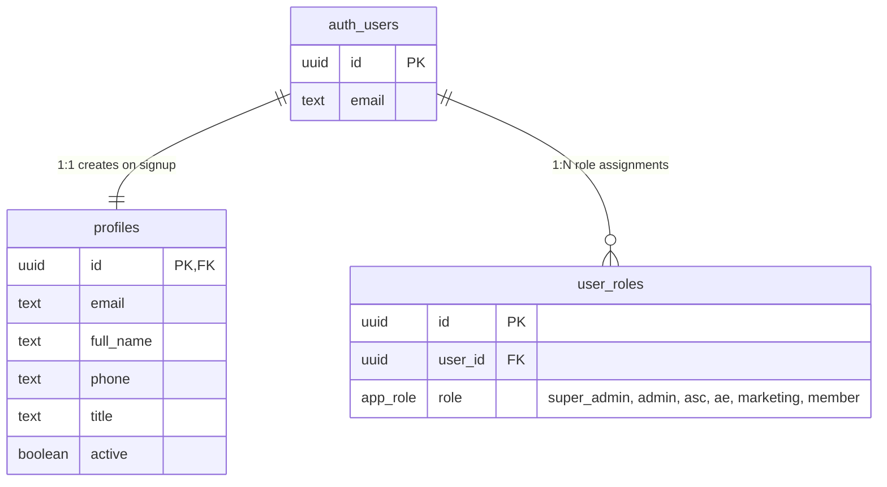

### Company & Brands

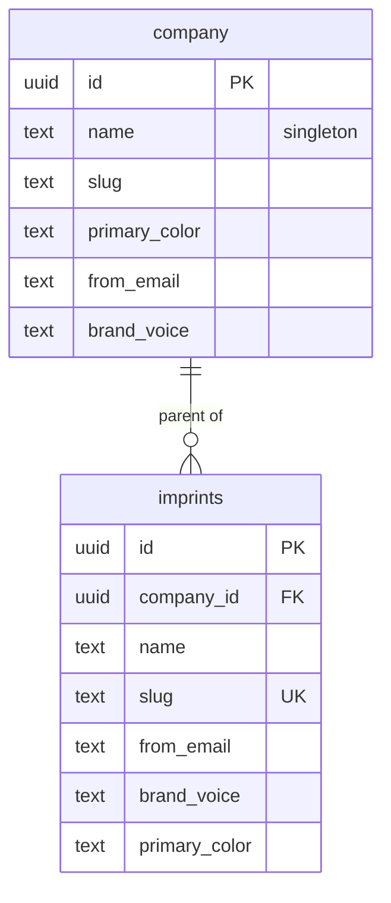

### Staff & Users

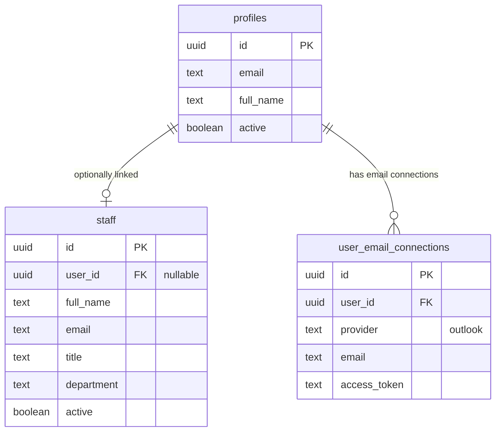

### CRM Contacts

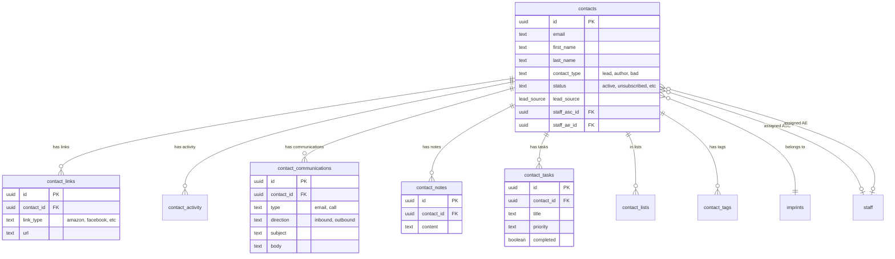

### Sales Pipeline

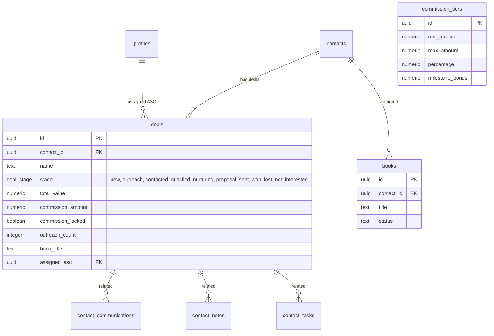

### Products Catalog

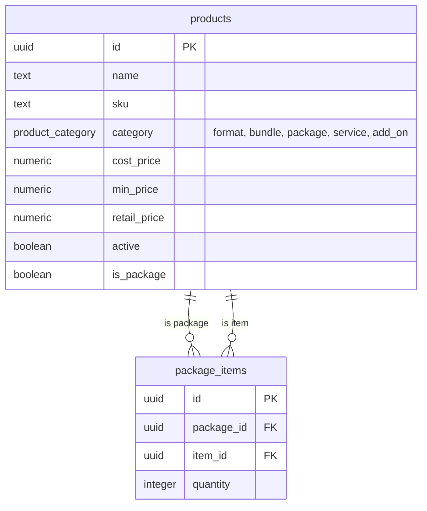

### Email Campaign Flow

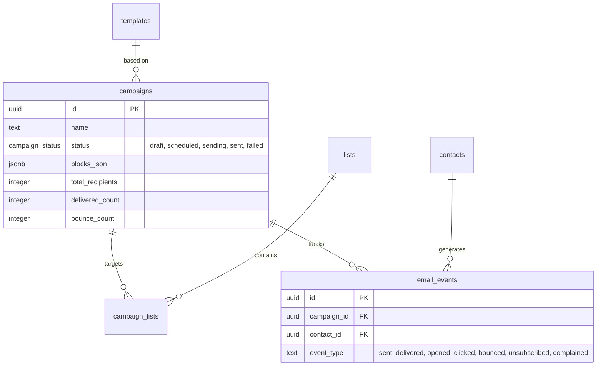

### Development Tracking

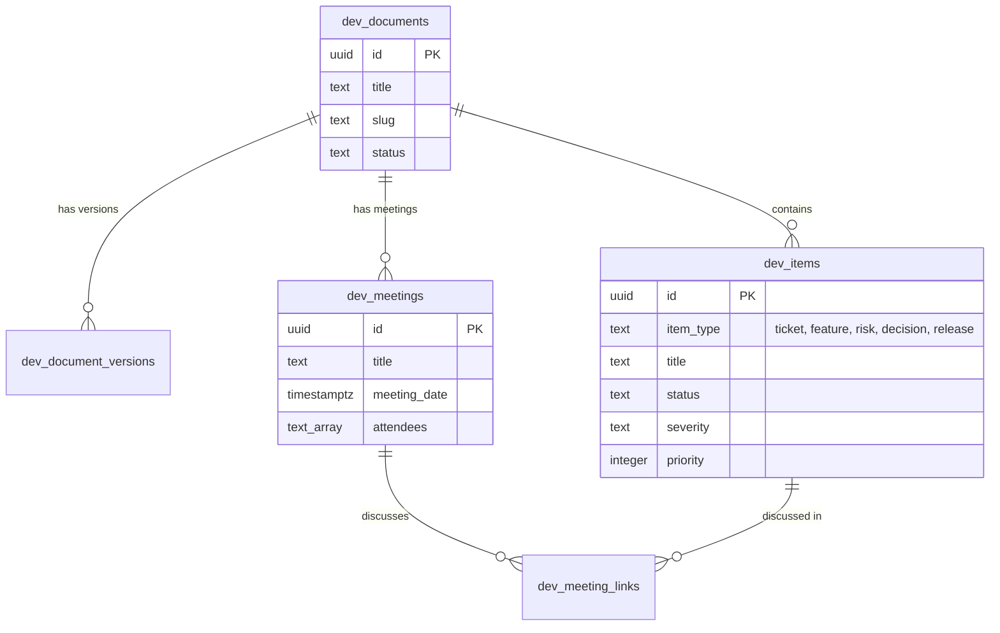

---

## Data Flow Diagrams

### Campaign Send Flow

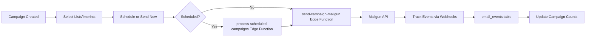

### Contact Activity Flow

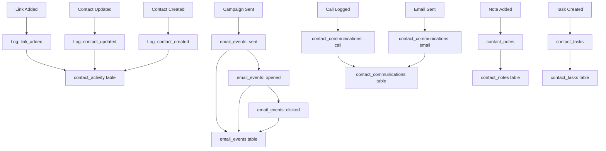

### Deal Pipeline Flow

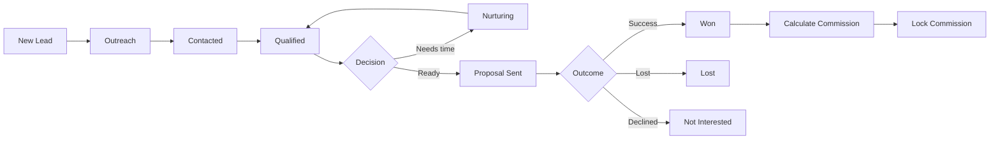

### Import Process Flow

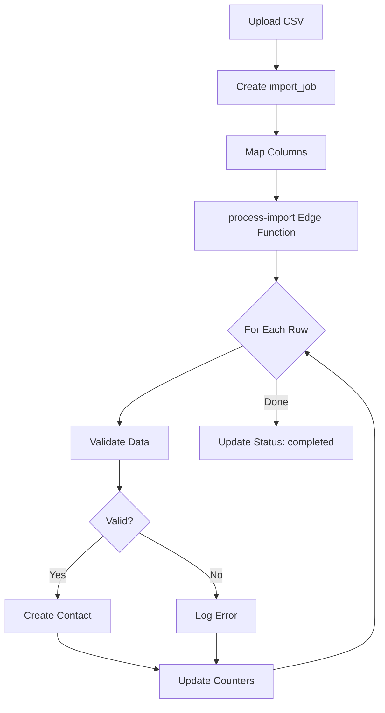

---

## Notes

- **PK** = Primary Key
- **FK** = Foreign Key
- **UK** = Unique Key
- All UUIDs use `gen_random_uuid()` for generation
- All timestamps are `TIMESTAMPTZ` (timezone-aware)
- RLS is enabled on all tables
- `auth.users` is managed by Supabase Auth (not directly modifiable)
- `company` table is a singleton (one row only)
- Staff records are separate from profiles for flexibility
- Deals track commission with optional locking for historical accuracy